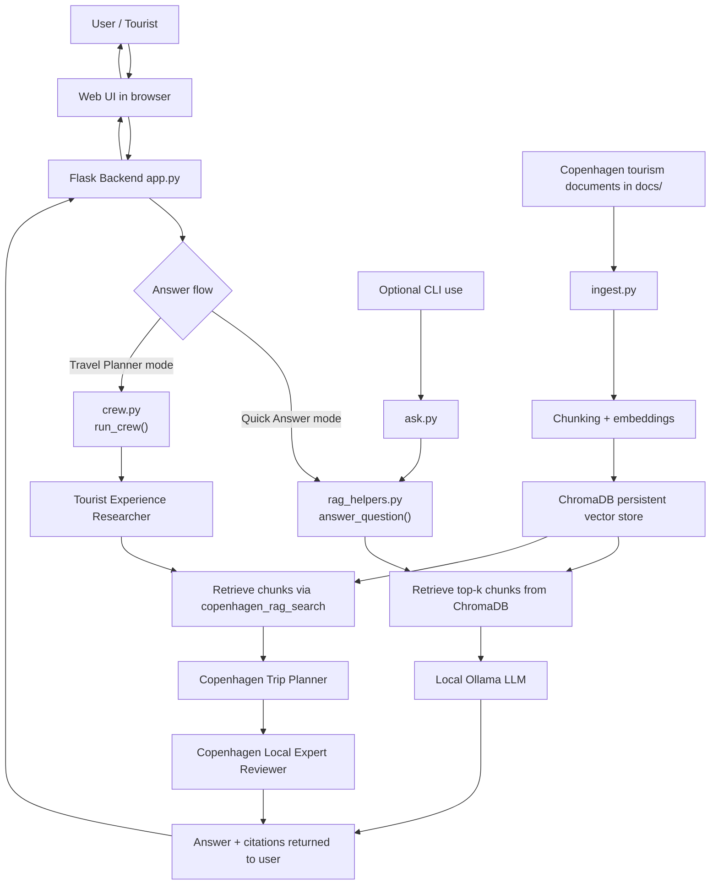

# Technical Documentation

## 1. Overall Architecture

This project is a local-first Copenhagen tourism chatbot with two answer modes:

- Quick Answer mode: direct RAG pipeline
- Travel Planner mode: CrewAI multi-agent pipeline built on top of the same RAG backend

### Architecture Layers

- Presentation layer: Flask routes in `app.py` + web UI in `templates/index.html` and `static/app.js`
- Orchestration layer:
  - Quick Answer: direct call to `answer_question()`
  - Travel Planner: `run_crew()` in `crew.py` with three sequential agents
- Knowledge retrieval layer: ChromaDB vector retrieval in `rag_helpers.py`
- Model inference layer: Ollama local HTTP endpoints (`/api/embed`, `/api/chat`)
- Data layer: source documents in `docs/`, persistent vectors in `chroma_db/`

### Runtime Paths

- `/api/chat/rag` -> direct RAG path (fast, single-pass)
- `/api/chat/crew` -> CrewAI path (research -> planning -> review)

### Mermaid Overview Diagram

### How The Diagram Reflects Architectural Choices

The Mermaid diagram visualizes the key architectural decision: **layered separation with dual pipelines**.

- **Presentation → Orchestration split**: Flask backend acts as a router (decision diamond) that branches into two distinct flows based on user choice. This modular design allows independent scaling of quick answers vs. multi-agent reasoning.
- **Shared knowledge layer**: Both pipelines (Quick Answer and Travel Planner) converge at ChromaDB retrieval, demonstrating code reuse and consistent grounding. No logic duplication.
- **Ingestion as separate flow**: The data layer is fed independently via `ingest.py`, so knowledge updates don't require system restart. This supports maintainability.
- **Optional CLI path**: Shows that the same RAG core (`answer_question()`) is reusable beyond the web interface, reinforcing modularity.
- **Local Ollama bottleneck**: All model calls go through a single local endpoint, making performance optimization and model swapping straightforward (edit `config.py` and reinitialize).

## 2. Which Local LLM Path Is Used

The system uses Ollama locally for both embeddings and generation.

### Embedding Path

- File: `rag_helpers.py`
- Function: `embed_texts()`
- Endpoint used: `${OLLAMA_HOST}/api/embed`
- Model: `EMBEDDING_MODEL` from `config.py` (default `embeddinggemma`)

### Generation Path (Quick Answer)

- File: `rag_helpers.py`
- Function: `chat_with_context()`
- Endpoint used: `${OLLAMA_HOST}/api/chat`
- Model: request model if supplied, otherwise `CHAT_MODEL` from `config.py`

### Generation Path (CrewAI)

- File: `crew.py`
- LLM object: `LLM(model=f"ollama/{CHAT_MODEL}", base_url=OLLAMA_HOST, ...)`
- Crew agents call `copenhagen_rag_search`, which calls `answer_question()` to ground outputs in local context.

## 3. How RAG Is Implemented

RAG is implemented as a custom local pipeline without external hosted vector or LLM services.

### Ingestion Phase (`ingest.py`)

1. Read files from `docs/` (`.md`, `.txt`, `.pdf`)
2. Convert files to text (`load_documents()` in `rag_helpers.py`)
3. Split text into chunks (`chunk_text()` in `chunking.py`)
4. Generate embeddings with Ollama (`embed_texts()`)
5. Store vectors, chunk text, IDs, and metadata in Chroma (`recreate_collection()` + `collection.add(...)`)

### Query Phase (`rag_helpers.py`)

1. Embed user question with Ollama (`embed_texts([question])`)
2. Retrieve top-k similar chunks from Chroma (`retrieve_context()`)
3. Build grounded prompt with retrieved chunks (`chat_with_context()`)
4. Generate answer through Ollama chat endpoint
5. Return:
   - final answer text
   - citations (source, chunk index, excerpt)
   - grounding flags (`grounded`, `no_answer`)

### Grounding Controls

- The system prompt in `chat_with_context()` instructs the model to:
  - answer using provided context
  - admit uncertainty when context is missing
  - cite chunk references like `[1]`, `[2]`

## 4. How The Different Parts Connect

### Web Request Flow: Quick Answer (`/api/chat/rag`)

1. Frontend sends question to Flask route
2. `app.py` extracts user input via `get_question_from_payload()`
3. `answer_question()` runs full RAG retrieval + generation
4. API returns JSON message + citations
5. Frontend renders markdown and sources

### Web Request Flow: Travel Planner (`/api/chat/crew`)

1. Frontend sends question to Flask route
2. `app.py` calls `run_crew(question)`
3. Crew executes sequential agents:
   - Tourist Experience Researcher
   - Copenhagen Trip Planner
   - Copenhagen Local Expert (review/polish)
4. Agents use `copenhagen_rag_search` tool for grounded facts
5. Final answer + collected citations returned as JSON

### Shared Components

- Both modes share:
  - same knowledge base (`chroma_db`)
  - same document corpus (`docs/`)
  - same local model host (`OLLAMA_HOST`)
  - same RAG helper functions

## 5. Known Limitations Or Risks

### Functional Limitations

- Retrieval quality depends heavily on source document quality and chunking strategy
- Top-k retrieval may omit relevant context for broad or ambiguous questions
- Citations are chunk-level, not sentence-level provenance
- Crew mode can be slower than quick mode because multiple agent steps are executed

### Operational Risks

- System requires local Ollama runtime and downloaded models to be available
- If embedding model changes after ingestion, existing vectors may become inconsistent until re-ingest
- Local hardware constraints (CPU/GPU/RAM) affect latency and response quality
- ChromaDB persistence is local filesystem-based; accidental deletion of `chroma_db/` removes index

### Safety And Output Risks

- The model may still produce stylistic embellishments beyond strict facts if prompts are vague
- Markdown rendering differences in frontend can affect readability of complex outputs (for example large tables)
- Crew-generated outputs can vary run-to-run due to LLM non-determinism

## 6. Main Files Reference

- `app.py`: Flask API routes and request handling
- `crew.py`: CrewAI agents, tasks, and execution
- `rag_helpers.py`: retrieval, embeddings, chat completion, citations
- `ingest.py`: index build pipeline into Chroma
- `chunking.py`: chunking strategy
- `config.py`: environment-backed defaults
- `static/app.js`: frontend request handling + markdown rendering
- `templates/index.html`: chat UI shell
